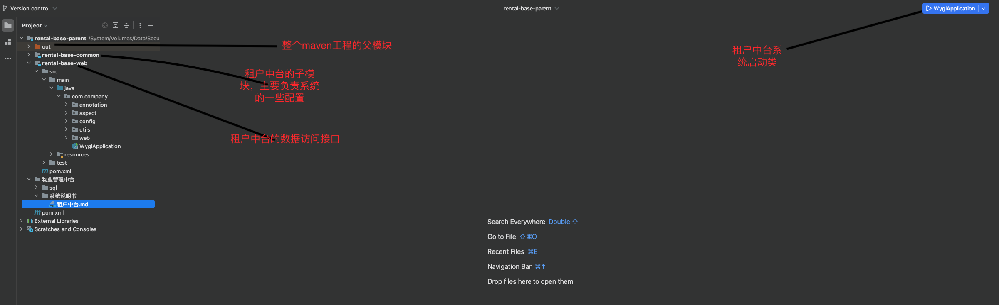

[TOC]
   ## 系统架构说明
   物业管理中采用Springboot+MybatisPlus+ElementUI2+SpringSecurity实现架构的管理,总共实现9大模块,
   分别为系统管理，房屋管理，车位管理,业主管理,收费管理,投诉管理,维修管理，公告管理等，实现了业主对小区的
   便捷
   
  ### 后端项目的截图

  #### 首页显示
<br/><br/><br/><br/><br/><br/><br/><br/><br/>


 ### 项目启动注意
  resources下面的application-test.yml里面的
  application-test.yml:
  ```
  #端口号配置
  server:
    port: 8089
  #数据库连接配置
  spring:
   datasource:
      type: com.alibaba.druid.pool.DruidDataSource
      driver-class-name: com.mysql.cj.jdbc.Driver
      url: jdbc:mysql://localhost:3306/wygl?useUnicode=true&characterEncoding=utf8&zeroDateTimeBehavior=convertToNull&useSSL=true&serverTimezone=GMT%2B8
      username: root
      password: 123456
```
server.port改为自己的后端访问自己<br/>
jdbc:mysql://localhost:3306/自己的数据库名<br/>
username: 自己的数据库账号<br/>
password: 自己的数据库密码<br/>